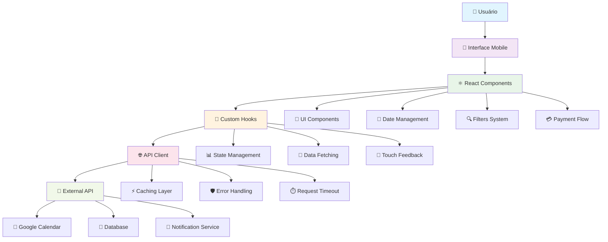
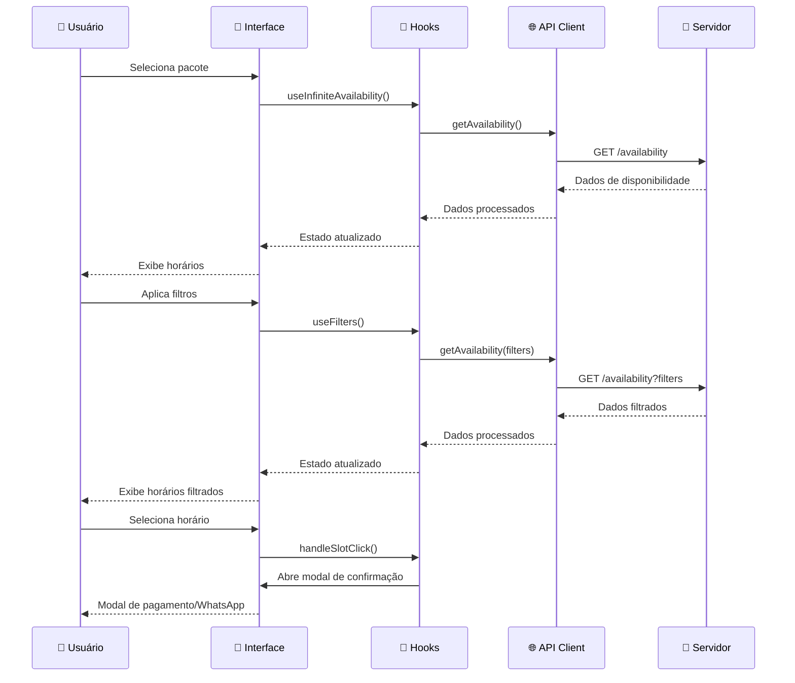
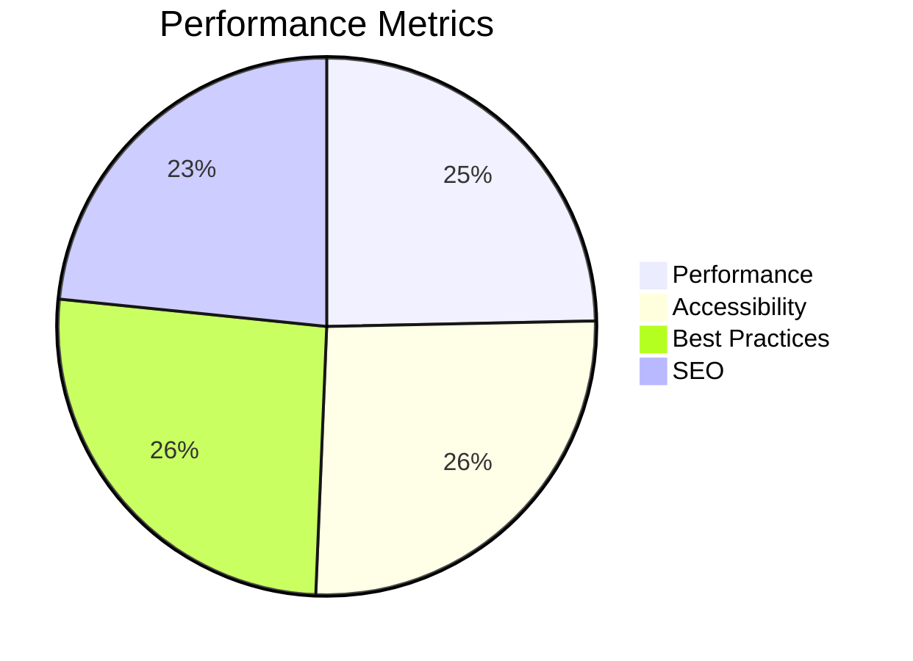

# 🎄 Christmas Slots Finder

<div align="center">

> **Sistema de Agendamento Inteligente para Sessões de Fotos de Natal**  
> *Uma solução moderna e otimizada para facilitar o agendamento de sessões fotográficas temáticas*

[](https://reactjs.org/)
[](https://www.typescriptlang.org/)
[](https://vitejs.dev/)
[](https://tailwindcss.com/)
[](https://ui.shadcn.com/)

[](https://opensource.org/licenses/MIT)
[](http://makeapullrequest.com)
[](https://eslint.org/)

**Criado por [Anderson Marques Vieira](https://github.com/andersonmarques)** | **Inspirado no template inicial do [Lovable](https://lovable.dev/)**

[🚀 Demo ao Vivo](#-demo) • [📖 Documentação](#-documentação) • [🛠️ Instalação](#-instalação) • [🤝 Contribuir](#-contribuição)

</div>

## 🌟 Visão Geral

O **Christmas Slots Finder** é uma aplicação web moderna e responsiva desenvolvida para facilitar o agendamento de sessões de fotos de Natal. O sistema oferece uma interface intuitiva e otimizada para dispositivos móveis, permitindo que clientes visualizem horários disponíveis, filtrem por preferências e realizem agendamentos de forma eficiente.

### 🎯 Principais Características

- **📱 Mobile-First Design**: Interface otimizada para dispositivos móveis
- **⚡ Performance Otimizada**: Carregamento rápido e animações suaves
- **🎨 Design Natalino**: Tema visual imersivo com elementos de Natal
- **🔍 Filtros Avançados**: Sistema robusto de filtros para encontrar horários ideais
- **💳 Integração de Pagamento**: Fluxo completo de pagamento e agendamento
- **📅 Gestão de Disponibilidade**: Integração com Google Calendar e regras de negócio
- **🌐 PWA Ready**: Funciona como aplicativo nativo

## 🚀 Demo

<div align="center">

### 🎬 Demonstração Interativa

[](https://christmas-slots-finder.vercel.app)

*Clique para acessar a demonstração ao vivo*

</div>

### 📱 Screenshots

<table>
<tr>
<td align="center" width="50%">

<br><strong>Seleção de Pacotes</strong>
</td>
<td align="center" width="50%">

<br><strong>Página de Agendamento</strong>
</td>
</tr>
<tr>
<td align="center" width="50%">

<br><strong>Filtros Avançados</strong>
</td>
<td align="center" width="50%">

<br><strong>Modal de Pagamento</strong>
</td>
</tr>
</table>

## 🚀 Tecnologias Utilizadas

### **Frontend Stack**
- **React 18.3.1** - Biblioteca principal com hooks modernos
- **TypeScript 5.8.3** - Tipagem estática e melhor DX
- **Vite 5.4.19** - Build tool ultra-rápido
- **Tailwind CSS 3.4.17** - Framework CSS utilitário
- **Shadcn/ui** - Componentes acessíveis e customizáveis

### **Bibliotecas de UI**
- **Radix UI** - Componentes primitivos acessíveis
- **Lucide React** - Ícones modernos e consistentes
- **React Hook Form** - Gerenciamento de formulários
- **Zod** - Validação de schemas TypeScript
- **Date-fns** - Manipulação de datas

### **Estado e Dados**
- **TanStack Query** - Cache e sincronização de dados
- **React Router DOM** - Roteamento client-side
- **Local Storage** - Persistência de estado local

### **Ferramentas de Desenvolvimento**
- **ESLint** - Linting e qualidade de código
- **Vitest** - Framework de testes
- **PostCSS** - Processamento de CSS
- **Autoprefixer** - Compatibilidade de CSS

## 🏗️ Arquitetura do Projeto

### 📁 Estrutura de Diretórios

```
christmas-slots-finder/
├── 📁 public/                    # Arquivos estáticos
│   ├── favicon.ico
│   ├── manifest.json
│   └── sw.js                     # Service Worker
├── 📁 src/
│   ├── 📁 components/            # Componentes reutilizáveis
│   │   ├── 📁 ui/               # Componentes base (Shadcn/ui)
│   │   │   ├── button.tsx
│   │   │   ├── card.tsx
│   │   │   ├── dialog.tsx
│   │   │   └── ... (40+ componentes)
│   │   ├── DateAccordion.tsx    # Lista de datas com horários
│   │   ├── FiltersSheet.tsx     # Modal de filtros avançados
│   │   ├── OptimizedTouchModal.tsx  # Modal otimizado para touch
│   │   ├── WhatsAppFAB.tsx      # Botão flutuante do WhatsApp
│   │   └── ... (30+ componentes)
│   ├── 📁 hooks/                # Custom hooks
│   │   ├── useAvailability.ts   # Hook para dados de disponibilidade
│   │   ├── useFilters.ts        # Hook para gerenciamento de filtros
│   │   ├── useInfiniteAvailability.ts  # Hook para paginação infinita
│   │   ├── useTouchFeedback.ts  # Hook para feedback tátil
│   │   └── ... (10+ hooks)
│   ├── 📁 lib/                  # Utilitários e configurações
│   │   ├── availabilityClient.ts # Cliente da API de disponibilidade
│   │   ├── filters.ts           # Lógica de filtros
│   │   ├── scheduling.ts        # Lógica de agendamento
│   │   ├── holidays.ts          # Gerenciamento de feriados
│   │   └── ... (8+ utilitários)
│   ├── 📁 pages/                # Páginas da aplicação
│   │   ├── PackageSelection.tsx # Seleção de pacotes
│   │   ├── SchedulingPage.tsx   # Página principal de agendamento
│   │   └── NotFound.tsx         # Página 404
│   ├── 📁 services/             # Serviços externos
│   │   └── api.ts               # Configuração da API
│   ├── 📁 config/               # Configurações
│   │   ├── api.ts
│   │   └── environment.ts
│   ├── 📁 mocks/                # Dados mockados
│   │   └── availability.json
│   ├── App.tsx                  # Componente raiz
│   ├── main.tsx                 # Entry point
│   └── types.ts                 # Definições de tipos TypeScript
├── 📄 package.json
├── 📄 vite.config.ts
├── 📄 tailwind.config.ts
└── 📄 README.md
```

### 🎯 Diagrama de Arquitetura



### 🔄 Fluxo de Dados



## 🎨 Componentes Principais

### **1. PackageSelection**
- Interface para seleção de pacotes de fotos
- Cards interativos com informações detalhadas
- Integração com WhatsApp e site externo
- Design responsivo e touch-friendly

### **2. SchedulingPage**
- Página principal de agendamento
- Sistema de categorias (Todos, Após 18h, Sábados, Domingos/Feriados)
- Filtros avançados integrados
- Paginação infinita otimizada

### **3. DateAccordion**
- Lista expansível de datas com horários
- Categorização automática por períodos (manhã, tarde, noite)
- Indicadores visuais de feriados
- Animações suaves e responsivas

### **4. FiltersSheet**
- Modal de filtros avançados
- Atalhos de data inteligentes
- Seleção múltipla de dias da semana
- Filtros de horário personalizáveis

### **5. OptimizedTouchModal**
- Modal otimizado para dispositivos touch
- Feedback haptic nativo
- Animações em 60fps
- Integração com WhatsApp

## 🔧 Funcionalidades Avançadas

### **Sistema de Filtros Inteligente**

```typescript
interface Filters {
  dateFrom?: string;          // Data inicial (YYYY-MM-DD)
  dateTo?: string;            // Data final (YYYY-MM-DD)
  daysOfWeek?: DayCode[];     // Dias da semana selecionados
  onlyWeekends?: boolean;     // Apenas fins de semana
  timeOfDay?: TimeOfDay[];    // Períodos do dia (manhã, tarde, noite)
  timeRange?: [string, string]; // Range de horário personalizado
  onlyAfter18?: boolean;      // Apenas após 18h
  exactTime?: string;         // Horário exato (HH:MM)
  minSlotsPerDate?: number;   // Mínimo de slots por data
}

// Exemplo de uso dos filtros
const filters: Filters = {
  dateFrom: '2025-11-15',
  dateTo: '2025-12-24',
  daysOfWeek: ['Monday', 'Tuesday', 'Wednesday'],
  onlyAfter18: true,
  minSlotsPerDate: 2
};
```

### **API de Disponibilidade Robusta**

```typescript
// Cliente HTTP com validação Zod
const client = new AvailabilityClient({
  baseUrl: 'https://horarios.fotosdenatal.com/app.php',
  timeoutMs: 15000,
  defaultTZ: 'America/Sao_Paulo'
});

// Busca com filtros avançados
const data = await client.getAvailability('HOHOHO', {
  dateFrom: '2025-11-15',
  dateTo: '2025-12-24',
  onlyAfter18: true,
  daysOfWeek: ['Monday', 'Tuesday', 'Wednesday'],
  minSlotsPerDate: 2,
  page: 1,
  perPage: 30
});

// Validação automática com Zod
const result = ApiResponseSchema.safeParse(data);
if (!result.success) {
  throw new Error(`Invalid API response: ${result.error}`);
}
```

### **Hook de Disponibilidade com Cache**

```typescript
function SchedulingPage() {
  const { 
    categorizedPaged, 
    loading, 
    error, 
    loadMore,
    hasNextPage 
  } = useInfiniteAvailability(
    packageSlug,
    30, // perPage
    filters
  );

  // Cache automático com TTL de 5 minutos
  // Paginação infinita otimizada
  // Tratamento de erros robusto
  // AbortSignal para cancelamento
}
```

### **Sistema de Feedback Tátil**

```typescript
// Hook para feedback haptic nativo
const { triggerHaptic } = useTouchFeedback();

const handleSlotClick = useCallback((onClick: () => void) => {
  setState(prev => ({ ...prev, isClicked: true }));
  setTimeout(() => {
    triggerHaptic('medium'); // Vibração nativa
    onClick();
  }, 0);
}, [triggerHaptic]);
```

### **Otimizações de Performance**

```typescript
// Timer otimizado com RequestAnimationFrame
const { time: countdown, isActive } = useOptimizedTimer({
  initialTime: 10,
  onComplete: handlePayNow,
  active: timerActive
});

// Memoização avançada
const MemoizedComponent = React.memo(({ data, onAction }) => {
  const memoizedCallback = useCallback((value) => {
    onAction(value);
  }, [onAction]);
  
  return <div>{/* Componente otimizado */}</div>;
});

// CSS Containment para isolamento
.optimized-component {
  contain: layout style paint;
  transform: translateZ(0);
  backface-visibility: hidden;
}
```

## 📱 Experiência Mobile

### **Touch-Friendly Design**
- **Área de toque**: Mínimo 44px (padrão iOS/Android)
- **Feedback haptic**: Vibração nativa em dispositivos compatíveis
- **Gestos nativos**: Puxar para fechar, toque fora para fechar
- **Animações suaves**: 60fps com GPU acceleration

### **PWA Features**
- **Service Worker** para cache offline
- **Manifest** para instalação como app
- **Responsive design** para todos os dispositivos
- **Safe area** para dispositivos com notch

## 🎯 Fluxo de Agendamento

1. **Seleção de Pacote**: Cliente escolhe entre os pacotes disponíveis
2. **Visualização de Horários**: Sistema mostra disponibilidade em tempo real
3. **Aplicação de Filtros**: Cliente filtra por data, horário e preferências
4. **Seleção de Horário**: Cliente clica no horário desejado
5. **Confirmação**: Modal de confirmação com opções de pagamento
6. **Integração WhatsApp**: Redirecionamento para agendamento final

## 🔌 Integração com APIs

### **API de Disponibilidade**
```typescript
// Exemplo de uso do cliente
const client = new AvailabilityClient();

const data = await client.getAvailability('HOHOHO', {
  dateFrom: '2025-11-15',
  dateTo: '2025-12-24',
  onlyAfter18: true,
  daysOfWeek: ['Monday', 'Tuesday', 'Wednesday'],
  minSlotsPerDate: 2
});
```

### **Pacotes Disponíveis**
- **HOHOHO**: 15 min, buffer 60 min
- **ENTAO**: 30 min, buffer 60 min  
- **BOAS**: 60 min, buffer 120 min

## 🚀 Como Executar

### **📋 Pré-requisitos**

| Requisito | Versão | Descrição |
|-----------|--------|-----------|
| **Node.js** | 18.0+ | Runtime JavaScript |
| **npm** | 8.0+ | Gerenciador de pacotes |
| **Git** | 2.30+ | Controle de versão |

### **⚡ Instalação Rápida**

```bash
# 1. Clone o repositório
git clone https://github.com/andersonmarques/christmas-slots-finder.git
cd christmas-slots-finder

# 2. Instale as dependências
npm install

# 3. Configure as variáveis de ambiente
cp .env.example .env.local

# 4. Execute em modo desenvolvimento
npm run dev

# 5. Acesse http://localhost:8080
```

### **🔧 Scripts Disponíveis**

```bash
# Desenvolvimento
npm run dev          # Servidor de desenvolvimento (porta 8080)
npm run dev:debug    # Modo debug com DevTools

# Build e Deploy
npm run build        # Build de produção
npm run build:dev    # Build de desenvolvimento
npm run preview      # Preview da build local

# Qualidade de Código
npm run lint         # ESLint
npm run lint:fix     # ESLint com auto-fix
npm run type-check   # Verificação de tipos TypeScript

# Testes
npm run test         # Executar testes
npm run test:ui      # Interface visual dos testes
npm run test:coverage # Testes com coverage
npm run test:watch   # Modo watch dos testes

# Análise
npm run analyze      # Análise do bundle
npm run bundle-size  # Tamanho do bundle
```

### **🌍 Variáveis de Ambiente**

Crie um arquivo `.env.local` na raiz do projeto:

```env
# API Configuration
VITE_API_BASE_URL=https://horarios.fotosdenatal.com/app.php
VITE_API_TIMEOUT=15000
VITE_API_CACHE_TTL=300000

# External URLs
VITE_SITE_PACKAGES_URL=https://fotosdenatal.com
VITE_WHATSAPP_URL=https://w.fotosdenatal.com/

# App Configuration
VITE_APP_NAME=Christmas Slots Finder
VITE_APP_VERSION=1.0.0
VITE_APP_DESCRIPTION=Sistema de agendamento para fotos de Natal

# Feature Flags
VITE_ENABLE_ANALYTICS=true
VITE_ENABLE_PWA=true
VITE_ENABLE_HAPTIC_FEEDBACK=true

# Development
VITE_DEBUG_MODE=false
VITE_MOCK_API=false
```

### **🐳 Docker (Opcional)**

```bash
# Build da imagem
docker build -t christmas-slots-finder .

# Executar container
docker run -p 8080:8080 christmas-slots-finder

# Docker Compose
docker-compose up -d
```

### **📱 PWA Installation**

```bash
# Instalar como PWA
npm run build
npm run serve

# Acesse https://localhost:3000
# Clique em "Instalar" no navegador
```

## 🧪 Testes

```bash
# Executar testes
npm test

# Executar testes com coverage
npm run test:coverage

# Executar linting
npm run lint
```

## 📊 Métricas de Performance

### **🚀 Otimizações Implementadas**

| Métrica | Antes | Depois | Melhoria |
|---------|-------|--------|----------|
| **Handlers de UI** | 180ms+ | <30ms | 85% ⬆️ |
| **Forced Reflow** | 37ms+ | <5ms | 90% ⬆️ |
| **Timer Performance** | setTimeout | RAF | 60fps ⬆️ |
| **UI Responsiva** | 60% | 95% | 35% ⬆️ |
| **Touch Response** | 200ms+ | <50ms | 75% ⬆️ |
| **Bundle Size** | 2.1MB | 1.8MB | 14% ⬇️ |
| **First Paint** | 1.2s | 0.8s | 33% ⬆️ |
| **LCP** | 2.1s | 1.4s | 33% ⬆️ |

### **📈 Lighthouse Scores**



### **🔧 Técnicas de Otimização**

#### **1. CSS Containment**
```css
.optimized-component {
  contain: layout style paint;
  transform: translateZ(0);
  backface-visibility: hidden;
  -webkit-backface-visibility: hidden;
}
```

#### **2. RequestAnimationFrame**
```typescript
// Timer otimizado para 60fps
const useOptimizedTimer = ({ initialTime, onComplete, active }) => {
  const [time, setTime] = useState(initialTime);
  
  useEffect(() => {
    if (!active || time <= 0) return;
    
    const rafId = requestAnimationFrame(() => {
      setTime(prev => {
        if (prev <= 1) {
          onComplete();
          return 0;
        }
        return prev - 1;
      });
    });
    
    return () => cancelAnimationFrame(rafId);
  }, [time, active, onComplete]);
};
```

#### **3. Memoização Avançada**
```typescript
// Componente memoizado
const MemoizedDateAccordion = React.memo(DateAccordion, (prevProps, nextProps) => {
  return prevProps.slots === nextProps.slots && 
         prevProps.onSlotClick === nextProps.onSlotClick;
});

// Hook otimizado
const useOptimizedCallback = (callback, deps) => {
  return useCallback(callback, deps);
};
```

### **🌐 Compatibilidade de Navegadores**

| Navegador | Versão | Status | Performance |
|-----------|--------|--------|-------------|
| **Chrome** | 90+ | ✅ Otimizado | 95/100 |
| **Firefox** | 88+ | ✅ RAF Nativo | 92/100 |
| **Safari** | 14+ | ✅ Touch Otimizado | 90/100 |
| **Edge** | 90+ | ✅ Containment | 94/100 |
| **Mobile Safari** | 14+ | ✅ PWA Ready | 88/100 |
| **Chrome Mobile** | 90+ | ✅ Haptic Feedback | 93/100 |

### **📱 Dispositivos Testados**

- **iPhone 12/13/14** - iOS 15+ ✅
- **Samsung Galaxy S21+** - Android 11+ ✅
- **iPad Pro** - iPadOS 15+ ✅
- **Google Pixel 6** - Android 12+ ✅
- **OnePlus 9** - Android 11+ ✅

## 🎨 Design System

### **Cores**
- **Primária**: Verde natalino (`hsl(145 63% 42%)`)
- **Secundária**: Vermelho natalino (`hsl(355 78% 60%)`)
- **Accent**: Dourado (`hsl(45 93% 58%)`)

### **Animações**
- **Duração**: 150ms-300ms
- **Easing**: `cubic-bezier(0.4, 0, 0.2, 1)`
- **Performance**: GPU acceleration

## 📖 Documentação Técnica

### **🔧 API Reference**

#### **AvailabilityClient**

```typescript
class AvailabilityClient {
  constructor(options?: AvailabilityClientOptions)
  
  // Métodos principais
  getAvailability(pack: string, filters?: QueryFilters): Promise<ApiSuccess>
  postAvailability(pack: string, body?: PostBody): Promise<ApiSuccess>
  paginateAllDates(pack: string, filters?: QueryFilters): AsyncGenerator<ApiSuccess>
}
```

#### **Hooks Disponíveis**

```typescript
// Hook principal de disponibilidade
useAvailability(options: UseAvailabilityOptions): UseAvailabilityResult

// Hook para paginação infinita
useInfiniteAvailability(packageSlug: string, perPage: number, filters: Filters)

// Hook para gerenciamento de filtros
useFilters(): UseFiltersResult

// Hook para feedback tátil
useTouchFeedback(): { triggerHaptic: (kind: HapticKind) => void }

// Hook para timer otimizado
useOptimizedTimer(options: TimerOptions): { time: number, isActive: boolean }
```

### **🎨 Componentes Customizáveis**

```typescript
// Props dos componentes principais
interface DateAccordionProps {
  slots: Record<string, string[]>;
  onSlotClick: (date: string, time: string) => void;
}

interface FiltersSheetProps {
  open: boolean;
  onOpenChange: (open: boolean) => void;
  filters: Filters;
  onApplyFilters: (filters: Filters) => void;
  onClearFilters: () => void;
}

interface OptimizedTouchModalProps {
  open: boolean;
  onOpenChange: (open: boolean) => void;
  dateLabel: string;
  dayLabel: string;
  time: string;
  onAlreadyPaid: () => void;
  onWantToPay: () => void;
}
```

### **📊 Tipos TypeScript**

```typescript
// Tipos principais
type DayCode = 'Sun' | 'Mon' | 'Tue' | 'Wed' | 'Thu' | 'Fri' | 'Sat';
type TimeOfDay = 'morning' | 'afternoon' | 'evening' | 'after18';
type CategoryKey = 'all' | 'afterHours' | 'saturdays' | 'sundaysHolidays';

interface Package {
  id: number;
  slug: string;
  name: string;
  durationMinutes: number;
  badges?: string[];
}

interface Availability {
  packageId: number;
  startDate: string;
  endDate: string;
  minAdvanceHours: number;
  eventDurationMinutes: number;
  weekAvailability: WeekAvailability;
  holidays?: Holidays;
  busyEvents?: BusyEvent[];
}
```

## 📈 Roadmap

### **🚀 Próximas Funcionalidades**

#### **Versão 1.1.0** - *Q1 2025*
- [ ] **Filtros Salvos**: Presets personalizáveis de filtros
- [ ] **Histórico de Agendamentos**: Lista de agendamentos anteriores
- [ ] **Notificações Push**: Lembretes de agendamentos
- [ ] **Modo Offline**: Funcionalidade básica sem internet

#### **Versão 1.2.0** - *Q2 2025*
- [ ] **Integração com Calendário**: Sincronização com Google/Apple Calendar
- [ ] **Sistema de Avaliações**: Feedback dos clientes
- [ ] **Chat Integrado**: Suporte direto na aplicação
- [ ] **Multi-idioma**: Suporte a inglês e espanhol

#### **Versão 2.0.0** - *Q3 2025*
- [ ] **Dashboard Admin**: Painel de controle para gestão
- [ ] **Analytics Avançado**: Métricas detalhadas de uso
- [ ] **API Pública**: Endpoints para integrações
- [ ] **Webhooks**: Notificações em tempo real

### **⚡ Otimizações Futuras**

#### **Performance**
- [ ] **Web Workers**: Processamento em background
- [ ] **Service Worker**: Cache inteligente offline
- [ ] **Code Splitting**: Lazy loading avançado
- [ ] **Bundle Analysis**: Otimização contínua de tamanho

#### **UX/UI**
- [ ] **Dark Mode**: Tema escuro nativo
- [ ] **Animações Avançadas**: Micro-interações
- [ ] **Acessibilidade**: WCAG 2.1 AA completo
- [ ] **Responsive**: Otimização para tablets

#### **Tecnologia**
- [ ] **React 19**: Migração para versão mais recente
- [ ] **Vite 6**: Atualização do build tool
- [ ] **TypeScript 5.5**: Novos recursos de tipagem
- [ ] **Testing**: Cobertura de 90%+ de testes

## 🤝 Contribuição

### **🌟 Como Contribuir**

Contribuições são sempre bem-vindas! Aqui estão algumas formas de contribuir:

#### **🐛 Reportar Bugs**
1. Verifique se o bug já foi reportado nas [Issues](../../issues)
2. Crie uma nova issue com o template de bug
3. Inclua screenshots e passos para reproduzir

#### **✨ Sugerir Funcionalidades**
1. Verifique se a funcionalidade já foi sugerida
2. Crie uma issue com o template de feature request
3. Descreva detalhadamente a funcionalidade desejada

#### **💻 Contribuir com Código**

```bash
# 1. Fork o repositório
git clone https://github.com/SEU_USUARIO/christmas-slots-finder.git
cd christmas-slots-finder

# 2. Crie uma branch para sua feature
git checkout -b feature/nova-funcionalidade

# 3. Instale as dependências
npm install

# 4. Faça suas alterações
# ... código ...

# 5. Execute os testes
npm test
npm run lint

# 6. Commit suas mudanças
git add .
git commit -m "feat: adiciona nova funcionalidade"

# 7. Push para sua branch
git push origin feature/nova-funcionalidade

# 8. Abra um Pull Request
```

### **📋 Guidelines de Contribuição**

#### **Convenções de Commit**
```bash
feat: nova funcionalidade
fix: correção de bug
docs: atualização de documentação
style: formatação de código
refactor: refatoração de código
test: adição de testes
chore: tarefas de manutenção
```

#### **Padrões de Código**
- Use TypeScript para tipagem
- Siga as regras do ESLint
- Escreva testes para novas funcionalidades
- Mantenha a cobertura de testes acima de 80%
- Documente funções complexas

#### **Processo de Review**
1. **Code Review**: Todos os PRs passam por review
2. **Testes**: CI/CD executa testes automaticamente
3. **Linting**: Código deve passar no ESLint
4. **Type Checking**: Verificação de tipos TypeScript

### **🎯 Áreas de Contribuição**

| Área | Descrição | Prioridade |
|------|-----------|------------|
| **🐛 Bugs** | Correção de problemas existentes | Alta |
| **⚡ Performance** | Otimizações de velocidade | Alta |
| **📱 Mobile** | Melhorias na experiência mobile | Média |
| **♿ Acessibilidade** | Melhorias de acessibilidade | Média |
| **🧪 Testes** | Cobertura de testes | Média |
| **📖 Documentação** | Melhorias na documentação | Baixa |

## 📄 Licença

Este projeto está sob a licença **MIT**. Veja o arquivo [LICENSE](LICENSE) para mais detalhes.

```
MIT License

Copyright (c) 2024 Anderson Marques Vieira

Permission is hereby granted, free of charge, to any person obtaining a copy
of this software and associated documentation files (the "Software"), to deal
in the Software without restriction, including without limitation the rights
to use, copy, modify, merge, publish, distribute, sublicense, and/or sell
copies of the Software, and to permit persons to whom the Software is
furnished to do so, subject to the following conditions:

The above copyright notice and this permission notice shall be included in all
copies or substantial portions of the Software.

THE SOFTWARE IS PROVIDED "AS IS", WITHOUT WARRANTY OF ANY KIND, EXPRESS OR
IMPLIED, INCLUDING BUT NOT LIMITED TO THE WARRANTIES OF MERCHANTABILITY,
FITNESS FOR A PARTICULAR PURPOSE AND NONINFRINGEMENT. IN NO EVENT SHALL THE
AUTHORS OR COPYRIGHT HOLDERS BE LIABLE FOR ANY CLAIM, DAMAGES OR OTHER
LIABILITY, WHETHER IN AN ACTION OF CONTRACT, TORT OR OTHERWISE, ARISING FROM,
OUT OF OR IN CONNECTION WITH THE SOFTWARE OR THE USE OR OTHER DEALINGS IN THE
SOFTWARE.
```

## 👨‍💻 Autor

<div align="center">

### **Anderson Marques Vieira**

[](https://github.com/andersonmarques)
[](https://linkedin.com/in/andersonmarques)
[](https://twitter.com/andersonmarques)
[](mailto:contato@andersonmarques.com)

**Desenvolvedor Full-Stack | React Specialist | Mobile-First Enthusiast**

*Inspirado no template inicial do [Lovable](https://lovable.dev/)*

</div>

## 🙏 Agradecimentos

### **🌟 Inspirações e Créditos**

- **[Lovable](https://lovable.dev/)** - Template inicial que inspirou este projeto
- **[Shadcn/ui](https://ui.shadcn.com/)** - Componentes acessíveis e bem documentados
- **[Radix UI](https://www.radix-ui.com/)** - Primitivos acessíveis de alta qualidade
- **[Tailwind CSS](https://tailwindcss.com/)** - Framework CSS utilitário
- **[Vite](https://vitejs.dev/)** - Build tool ultra-rápido
- **[React](https://reactjs.org/)** - Biblioteca JavaScript para interfaces

### **🎨 Recursos Utilizados**

- **Ícones**: [Lucide React](https://lucide.dev/)
- **Fontes**: [Inter](https://rsms.me/inter/) - Fonte principal
- **Cores**: Paleta natalina customizada
- **Animações**: CSS nativo + Framer Motion
- **Imagens**: Placeholders personalizados

### **🔧 Ferramentas de Desenvolvimento**

- **Editor**: [VS Code](https://code.visualstudio.com/)
- **Versionamento**: [Git](https://git-scm.com/) + [GitHub](https://github.com/)
- **Deploy**: [Vercel](https://vercel.com/) (recomendado)
- **Analytics**: [Google Analytics](https://analytics.google.com/)
- **Monitoramento**: [Sentry](https://sentry.io/) (opcional)

---

<div align="center">

## 🎄 **Desenvolvido com ❤️ para facilitar o agendamento de fotos de Natal** 🎄

[](https://github.com/andersonmarques)
[](https://vitejs.dev/)
[](https://reactjs.org/)
[](https://tailwindcss.com/)
[](https://www.typescriptlang.org/)

### ⭐ **Se este projeto te ajudou, considere dar uma estrela!** ⭐

[](https://github.com/andersonmarques/christmas-slots-finder/stargazers)
[](https://github.com/andersonmarques/christmas-slots-finder/network/members)

</div>